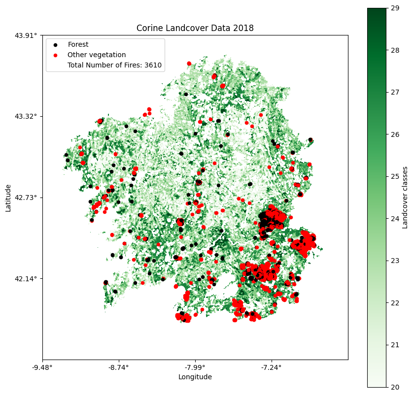

 

  <h1 align="center">Predicting and Analysing Forest Fires Susceptibility in Galicia, Spain: A Machine Learning Approach</h1>
  

   

  

    
     
    <h3 align="center"><strong>Coding Foundation</strong></h3>

  
   
  

 

## About The Project

In this repository the code is provided, that I used to create a dataset incorpocrating historic forest fire events and environmental data in Galicia between the years 2020 and 2022. A Random Forest Classifier, an XGB Classifier and an Easy Ensemble Classifier were used to predict forest fire susceptibility in Galicia and evaluated throughout different validation steps. The results and validation methods are provided as well. Used features for the prediction were: NDVI, altitude, slope, aspect, curvature, temperature, relative humidity, precipitation and wind parameters.

(<a href="#readme-top">back to top</a>)

## Content

- 'dataset_preperation/':  Here the files for creating the dataset are included.
  - `prepare_dataset.py`: Here the different data gathering steps are applied and merged in one dataset.
  - `prepare_ndvi.py`: Collects NDVI data for a dataset with coordinates and dates. <a href="https://terrascope.be/en"><u>Terrascope</u></a> login required.
  - `prepare_topo_data.py`: Collects altitude, slope, aspect and curvature for a dataset with coordinates. Data had to be downloaded before from  <a href="https://www.ign.es/web/inicio?locale=es"><u>Instituto Geográfico Nacional</u></a> and terrain attributes were created with <a href="https://richdem.readthedocs.io/en/latest/"><u>RichDEM</u></a>
  - `prepare_weather_data.py`: Collects weather data for the nearest weather station in Galicia given a longitude, latitude and time. Historic weather data had to be downloaded beforehand from <a href="https://www.aemet.es/en/datos_abiertos/AEMET_OpenData"><u>@AEMET</u></a> or in 'crawler_weather_stations_galicia.py'
  - `crawler_weather_stations_galicia.py`: Collects historic weather data for a time range given a dataframe with weather station indicators and longitude and latitudes.
  - `utils.py`: collection of different functions, for instance, random sampling of negative datapoints and grouping of datapoints to process them more efficiently
- 'results/': Here the models are applied on the dataset and evaluated, as well as the feature importance visualised.
  - `results_utils.py`: Here all the methods for evaluation and visualisation can be found.
  - `results_main.py`: An exemplary run of the different validation steps. [Results](https://nbviewer.jupyter.org/github/Chardes01/Predicting-and-Analysing-Forest-Fire-Susceptibility-in-Galicia-Spain/blob/main/results/results_main.ipynb)

## Prerequisites

- Python libraries:
  - pandas
  - scikit-learn
  - matplotlib
  - numpy
  - geopandas
  - shapely
  - xgboost
  - imbalanced-learn
  - rasterio
  - terracatalogueclient
  - pyproj
  - GDAL
  - tqdm

## Data Sources

- NDVI data can be recieved from Terrascope <a href="https://terrascope.be/en"><u>here</u></a> 
- a digital terrain model for Galicia can be downloaded at the <a href="https://www.ign.es/web/inicio?locale=es"><u>Instituto Geográfico Nacional</u></a>
- weather data can be downloaded at <a href="https://www.aemet.es/en/datos_abiertos/AEMET_OpenData"><u>@AEMET</u></a> 
- landcover data, that was used for creating a vegetation map, can be found at <a href="https://land.copernicus.eu/en/products/corine-land-cover/clc2018"><u>Copernicus Land Monitoring Service</u></a>

## License

Distributed under the MIT License. See `LICENSE.txt` for more information.

(<a href="#readme-top">back to top</a>)

